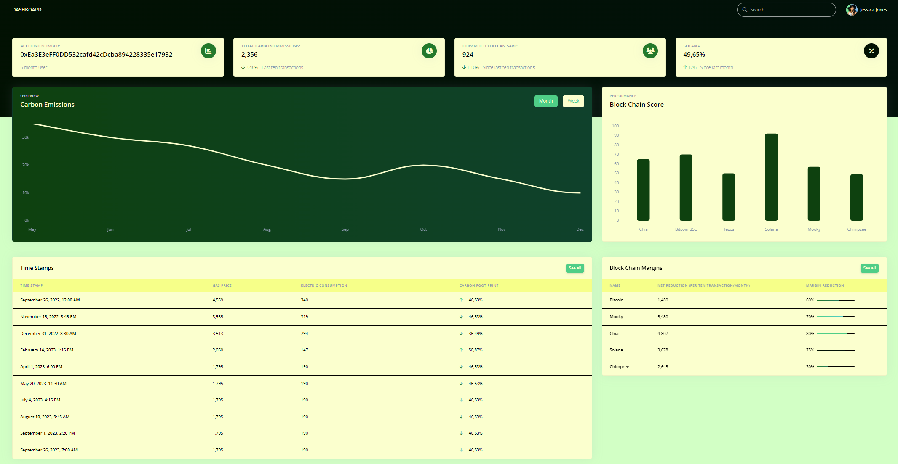

# GreenChain
## GreenChain is a web-based application that allows crypto traders and enthusiasts to measure the carbon footprint of their transactions on the Ethereum blockchain network. Users can link their public addresses to the app, allowing for automatic carbon footprint calculation. The platform would also suggest ways to offset the environmental impact and provide insights into greener blockchain alternatives.
## 